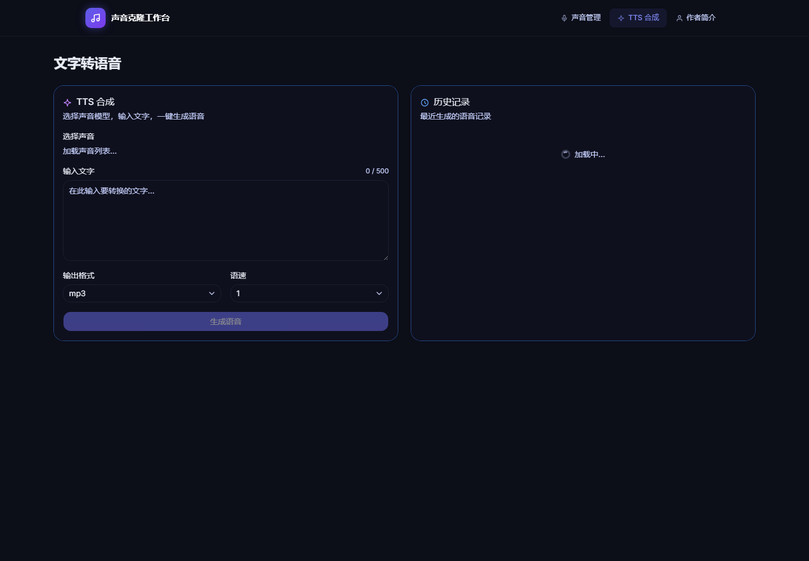

# Voice Clone Platform

A resume-oriented voice cloning web application built with Next.js and deployed on Cloudflare Workers through OpenNext.

Live demo: https://voice-clone.sifanxin00.workers.dev

## What It Does

- Uploads and manages reference voice samples.
- Creates text-to-speech jobs through the Fish Audio API.
- Stores voice records and generation history with Cloudflare D1.
- Stores uploaded samples and generated audio with Cloudflare R2.
- Provides pages for voice management, TTS generation, history, and project author information.

## Tech Stack

- Next.js 16, React 19, TypeScript
- Tailwind CSS and reusable UI components
- Drizzle ORM with Cloudflare D1
- Cloudflare R2 for audio files
- OpenNext for Cloudflare Workers deployment
- Fish Audio API for voice cloning and speech generation

## Screenshot



## Local Development

```bash
npm install
cp .env.example .env.local
npm run dev
```

Then open http://localhost:3000.

`FISH_AUDIO_API_KEY` is required for real API calls. The repository intentionally does not include local databases, uploaded audio, generated audio, or production secrets.

## Cloudflare Deployment

1. Create a D1 database and R2 bucket in Cloudflare.
2. Update `wrangler.toml` with your own D1 database ID, bucket name, and optional custom domain.
3. Add the Fish Audio key as a Worker secret:

```bash
npx wrangler secret put FISH_AUDIO_API_KEY
npm run cf:deploy
```

## Repository Hygiene

This public version excludes:

- `.env.local` and all private environment files
- `.next`, `.open-next`, `.wrangler`, and other build outputs
- local SQLite/D1 test data
- uploaded or generated audio files
- personal contact assets such as QR codes

## License

MIT
